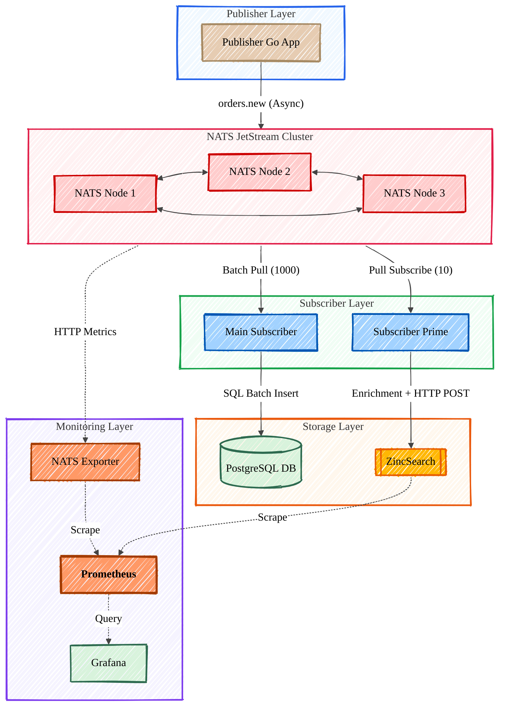

# NATS JetStream Distributed Pipeline

A high-performance, distributed messaging architecture utilizing a 3-node NATS JetStream cluster, PostgreSQL for persistent storage, and ZincSearch for data indexing.

## 🏗 Architecture

The system follows a producer-consumer pattern with high-availability and monitoring integrated into the stack.



### Components
- **Publisher**: Asynchronous Go application featuring flow control via `PublishAsyncMaxPending(5000)` and a retry-on-stall loop to ensure 100% delivery of 100,000 messages. **Note: The publisher is responsible for creating the JetStream `ORDERS` stream.**
- **NATS Cluster**: 3-node cluster configured with JetStream, using `FileStorage` and 3-way replication (`Replicas: 3`) for high availability.
- **Main Subscriber**: Durable pull consumer that utilizes SQL transactions to process and save messages in batches of 1000 to PostgreSQL.
- **Subscriber Prime**: Secondary consumer that enriches data with random primes and indexes the results into ZincSearch.
- **Monitoring**: A full observability stack where Prometheus scrapes the NATS Exporter and ZincSearch, visualized through a specialized Grafana dashboard.

## 🚀 Getting Started

### Prerequisites
- Docker & Docker Compose
- Go 1.23+ (specified in mod files)

### ⚠️ Important Startup Sequence
Because the **Publisher** programmatically creates the `ORDERS` JetStream in NATS upon startup, the **Subscribers** must wait for the stream to exist before they can bind to it. 
If a subscriber starts before the stream is created, it will throw a `Subscription Error`. **Always ensure the publisher has initialized the stream first!**

### Deployment & Docker Compose Commands

1. **Prepare Host Directories**: Ensure your Windows host has the following paths for persistent volumes:
   - `C:/temp/nats-data-1`
   - `C:/temp/nats-data-2`
   - `C:/temp/nats-data-3`
   - `C:/temp/postgres-app-data`

2. **Build the infrastructure and applications**:
   ```bash
   docker-compose -f docker-compose-cluster.yml build
   ```

3. **Start the cluster and services in the background**:
   ```bash
   docker-compose -f docker-compose-cluster.yml up -d
   ```

4. **View live logs for a specific service** (e.g., to watch the publisher):
   ```bash
   docker logs -f nats-publisher-1
   ```

5. **Stop all services**:
   ```bash
   docker-compose -f docker-compose-cluster.yml down
   ```

6. **Hard Reset (Stop and remove volumes)** - *Use this if you want to wipe the database and NATS storage to start completely fresh:*
   ```bash
   docker-compose -f docker-compose-cluster.yml down -v
   ```

## 📊 Monitoring & Access
- **Grafana**: `http://localhost:3001` (Credentials: admin/admin)
- **Prometheus**: `http://localhost:9090`
- **ZincSearch**: `http://localhost:4080` (Credentials: admin/password)
- **Cobra NATS (UI)**: `http://localhost:8080`

## 🛠 Features
- **Data Integrity**: The publisher implements a blocking retry mechanism that stays on the same message index until confirmed by the cluster.
- **Efficiency**: The Main Subscriber uses prepared statements and batch commits (1000 messages) to minimize database overhead.
- **Resilience**: Durable subscriptions (`MAIN_BATCH_WORKER` and `PRIME_PROCESSOR`) allow consumers to resume processing exactly where they left off after a restart or crash.
