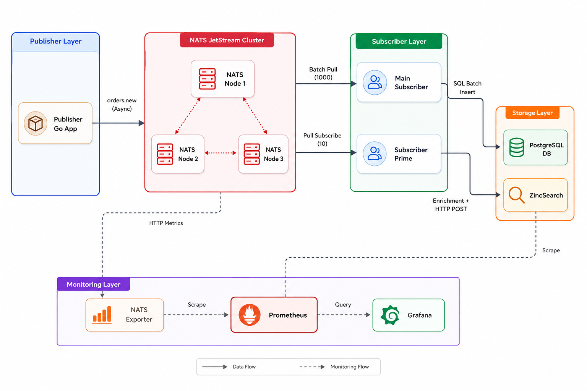

<p align="center">
  
</p>

<h1 align="center">NATS JetStream Playground</h1>

<p align="center">
An Open Source Proof of Concept demonstrating distributed messaging with NATS JetStream.
</p>

<p align="center">


</p>

---

# 📖 Overview

This Proof of Concept demonstrates a distributed messaging architecture built with **NATS JetStream**.

The platform includes a three-node JetStream cluster, multiple Go applications, PostgreSQL for persistent storage, ZincSearch for indexing, and a complete monitoring stack based on Prometheus and Grafana.


---

# 🏗️ Architecture

<p align="center">
  
</p>

---


# 🧩 Components

### 📨 Publisher

Asynchronous Go application responsible for publishing messages to JetStream.

The publisher creates the **ORDERS** stream automatically and uses asynchronous publishing with flow control to guarantee reliable delivery.

---

### ⚡ NATS JetStream Cluster

Three-node NATS cluster configured with JetStream using:

- File Storage
- Replication Factor: **3**
- High Availability

The cluster acts as the messaging backbone for the platform.

---

### 📥 Main Subscriber

Durable pull consumer responsible for processing incoming messages.

Messages are written to PostgreSQL using SQL transactions and batch commits for improved throughput.

---

### 🔢 Prime Subscriber

Independent consumer that enriches incoming messages by generating random prime numbers before indexing them into ZincSearch.

This demonstrates how multiple consumers can process the same event stream independently.

---

### 🗄 PostgreSQL

Persistent storage used by the Main Subscriber.

Provides durable storage for processed events.

---

### 🔎 ZincSearch

Indexes enriched events produced by the Prime Subscriber.

Useful for search, analytics and log exploration.

---

### 📊 Monitoring

The platform includes a complete observability stack:

- Prometheus
- Grafana
- NATS Exporter

allowing real-time monitoring of the messaging platform.

---

# 🎯 Objective

This Proof of Concept demonstrates how to:

- Deploy a highly available NATS JetStream cluster.
- Publish messages asynchronously.
- Consume messages using durable consumers.
- Persist events into PostgreSQL.
- Enrich data before indexing into ZincSearch.
- Monitor the entire platform using Prometheus and Grafana.

---

# ⚙️ Prerequisites

- Docker
- Docker Compose
- Go 1.23+

---

# ⚠️ Important Startup Sequence

The **Publisher** is responsible for creating the **ORDERS** JetStream stream during startup.

Because the **Subscribers** bind to this stream, they **must wait until the stream has been created** before starting.

If a subscriber starts before the stream exists, it will fail with a subscription error.

The correct startup sequence is:

```text
Start NATS Cluster
        │
        ▼
Start Publisher
        │
Creates ORDERS Stream
        │
        ▼
Start Subscribers
        │
        ▼
Begin Processing Messages
```

The provided Docker Compose configuration follows this startup sequence automatically.

---

# 🚀 Deploy the Platform

Build the containers:

```bash
docker compose -f docker-compose-cluster.yml build
```

Start the platform:

```bash
docker compose -f docker-compose-cluster.yml up -d
```

---

# 🔍 Verification

Verify that all services are running:

```bash
docker ps
```

Verify the NATS cluster:

```bash
docker logs nats-node-1
```

Verify the publisher:

```bash
docker logs nats-publisher-1
```

Verify the subscribers:

```bash
docker logs subscriber-main
docker logs subscriber-prime
```

---

# 🧪 Testing

The publisher automatically creates the **ORDERS** JetStream stream before publishing messages.

Once started, it publishes **100,000 messages** asynchronously.

Observe the consumers:

```bash
docker logs -f subscriber-main

docker logs -f subscriber-prime
```

Observe PostgreSQL persistence.

Observe ZincSearch indexing.

---

# 📊 Monitoring

Grafana

```
http://localhost:3001
```

Credentials

```
admin
admin
```

Prometheus

```
http://localhost:9090
```

ZincSearch

```
http://localhost:4080
```

Credentials

```
admin
password
```

---

# 📚 What You Will Learn

After completing this Proof of Concept, you will understand how to:

- Deploy a distributed NATS JetStream cluster.
- Configure replicated streams.
- Publish messages asynchronously.
- Implement durable consumers.
- Persist events to PostgreSQL.
- Build asynchronous processing pipelines.
- Monitor distributed messaging systems.

---

# 🧹 Cleanup

Stop the platform:

```bash
docker compose -f docker-compose-cluster.yml down
```

Remove containers and persistent volumes:

```bash
docker compose -f docker-compose-cluster.yml down -v
```

---

# 📚 References

- https://nats.io/
- https://docs.nats.io/
- https://docs.nats.io/nats-concepts/jetstream

---

# 🏛 About OpenMind Systems Lab

OpenMind Systems Lab is an independent French non-profit association dedicated to research, experimental development and technical benchmarking in Cloud Native technologies.

Our mission is to produce practical, reproducible and educational Open Source Proofs of Concept covering Kubernetes, Platform Engineering, Distributed Messaging, Infrastructure Security and Artificial Intelligence.

GitHub Organization:

https://github.com/openmind-systems-lab

---

<p align="center">
Made with ❤️ by OpenMind Systems Lab
</p>
